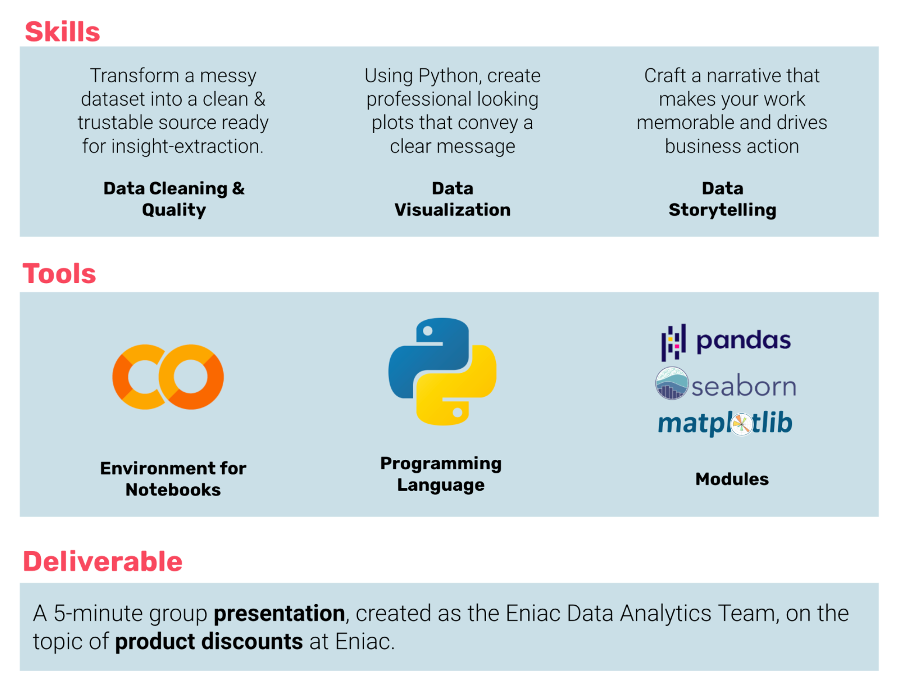

# Data Cleaning & Storytelling Case Study 📊

Welcome to our in-depth case study where we tackle both data quality and storytelling. Dive deep into an e-commerce dataset, derive actionable insights, and overcome the hurdle of messy data!

## Table of Contents
- [📌 Objective](#-objective)
- [📂 Dataset Overview](#-dataset-overview)
- [🛠 Getting Started](#-getting-started)
- [🤔 Questions to Address](#-questions-to-address)
- [📝 Notes](#-notes)
- [⚖️ License](#-license)
- [Data Cleaning](#data-cleaning)
- [Data Categorization](#data-categorization)
- [Data Exploration & Analysis](#data-exploration--analysis)
- [Explanatory Plots](#explanatory-plots)
- [Tools & Libraries](#tools--libraries)

## 📌 Objective 
This analysis aims to address the following:
- Classifying products into different categories for simplified reporting.
- Assessing product price distribution across categories.
- Evaluating the extent of product discounts.
- Understanding sales patterns during special occasions like Christmas and Black Friday.
- Suggestions to improve data collection methodologies.

> ❗ Data inconsistency alert! Before jumping into the analysis, note that the data appears to have inconsistencies. But, as they say in the data science world, data cleaning is 80% of the job. Let's get our hands dirty!

## 📂 Dataset Overview

### 1. `orders.csv`
- **order_id**: Unique identifier for each order.
- **created_date**: Timestamp for order creation.
- **total_paid**: Total amount paid by the customer, in euros.
- **state**: Order status (e.g., Shopping basket, Place Order, Pending, Completed, Cancelled).

### 2. `orderlines.csv`
- **id**: Unique identifier for each row.
- **id_order**: Corresponds to `orders.order_id`.

### 3. `products.csv`
- **sku**: Stock keeping unit; unique identifier for each product.
- ... (continue with other columns)

### 4. `brands.csv`
- **short**: 3-character code for brand identification based on `products.sku`.
- **long**: Full brand name.

## 🛠 Getting Started
Start by taking a glimpse of the data:
- Used `DataFrame.head()` and `DataFrame.tail()` to visualize top and bottom rows.
- Used functions like `DataFrame.describe()`, `DataFrame.isna().any()`, and others to get a sense of data quality and structure.

## 🤔 Questions to Address
As one dive deep, consider the following questions:
- How many orders are there? 
- How should revenue be computed?
- What are the top 5 brands?

## Data Cleaning

### Null Value Treatment
- Check for null values using `data.isnull().sum()`.
- Decide on imputation or removal.

### Outlier Detection
- Use scatter plots or box plots to visualize outliers.
- Consider techniques like the IQR method to handle outliers.

### Encoding & Transformation
- Convert categorical variables to numerical format.
- Normalize or standardize values when needed.

## Data Categorization
### Product Categories
- Source columns: `name`, `desc`.
- Goal: Identify patterns or keywords linking a product to a category.

### DataFrame Display Adjustments
python
pd.set_option('display.max_rows', 1000)
pd.set_option("display.max_colwidth", 100)

## ⚖️ **License**

MIT

### 3. **Handle Missing Values**
   - Identify missing data using `data.isnull().sum()`.
   - Determine whether to impute or remove the missing values based on the context. 
     - For categorical data: Consider filling with mode or a placeholder like "Unknown".
     - For numerical data: Consider filling with mean, median, or using methods like forward-fill or backward-fill.

### 4. **Outliers and Data Consistency**
   - Visualize potential outliers using scatter plots or box plots.
   - Use methods like the IQR (Interquartile Range) to detect and manage outliers.
   - Ensure consistency in categorical data. For instance, "Male" and "male" should be consistent.

### 5. **Encoding & Data Transformation**
   - Convert categorical variables into a format suitable for analysis, e.g., one-hot encoding or label encoding.
   - Normalize or standardize numerical features when necessary, especially if using algorithms sensitive to different scales.

## Data Exploration and Analysis

### 1. **Revenue Analysis**
   - Compare `products.price`, `orderlines.unit_price`, and `orders.total_paid` to understand pricing dynamics.
   - Analyze the most profitable products or categories.

### 2. **Sales Patterns**
   - Analyze sales trends over time.
   - Identify any seasonal patterns or anomalies.

### 3. **Customer Analysis**
   - Segment customers based on purchase behaviors.
   - Identify high-value customers or those at risk of churn.

## Data Visualization

### 1. **Choosing the Right Visualization**
   - Use bar charts for categorical data comparison.
   - Line plots are ideal for time series data.
   - Scatter plots can help identify relationships or trends between two numeric variables.

### 2. **Enhancing Visualization**
   - Use color and size wisely to highlight trends and focus areas.
   - Annotate plots to guide the viewer to key insights.
   - Use visualization libraries like Matplotlib, Seaborn, or Plotly for Python-based visualization.

### 3. **Interactive Dashboards**
   - Consider creating interactive dashboards using tools like Tableau or PowerBI.
   - Alternatively, use Python libraries like Dash by Plotly for web-based dashboards.

## 📝 **Notes**
While delving into the data analysis and visualization, always ensure that the findings are communicated in a comprehensible and impactful manner. Data insights are most valuable when they're easily understandable. Constantly refer back to this guide as you work through the dataset, ensuring all steps are meticulously followed and each analysis is underpinned by a clear rationale.

## **Conclusion**

Mastering the art of data analysis and visualization is crucial for extracting valuable insights from your product data. By following the guidelines outlined above, you can transform raw data into actionable strategies and visually compelling stories. Remember, it's not just about what the data says, but how effectively you communicate it!

# **Tools & Libraries**

